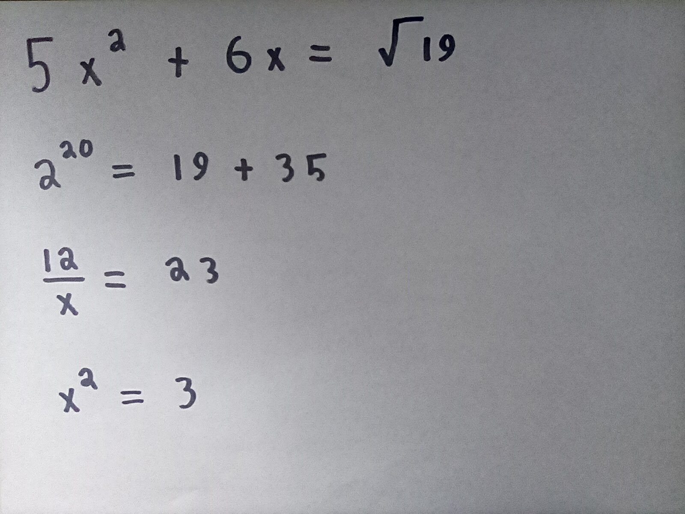
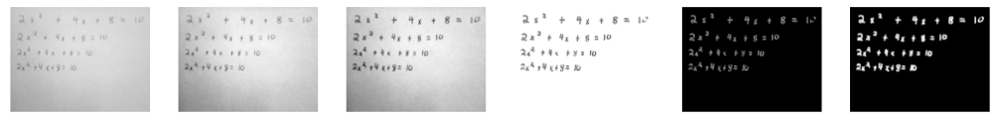

# Morgana-OCR
OCR ML Project, specifically targeting mathematical expressions, for use in Project-Morgana

Built in May, 2021

## Summary
This repository contains a collection of ML models and notebooks from while I was researching how one could go about building a robust OCR model to parse text written on whiteboards.  This was back in the early days of the pandemic, you see, when having a whiteboard was all the rage and doing math homework on one left much to be desired, namely the lack of Desmos.  I wanted to build an intelligent system that could understand what I was doing and then pull up relevant information from different sources.  You can really see the throughline from Aurras, can't you?

While I never succeeded in my goal, I was able to achieve a rather impressive accuracy, given that my classification method was literally based on MNIST.

## Project Future
Morgana is very much a project I mean to return to; it's tied up in my whole build-virtual-assistant Aurras goals.  The OCR specifically might be a little unnecessary now that we're seeing such seemingly powerful multi-modal models like GPT-4 that can (if OpenAI is to be believed) effortlessly parse text from images.

Still, as a side project that captivated my attention for a few weeks, it brought much joy.  Projects contain annotated ipynb files from the last time I ran each project, which means there are enough images & logging messages to get a feel for what's going on.  Beyond that, best of luck since I have better things to do than refactoring two-year-old (and obsolete) code.

